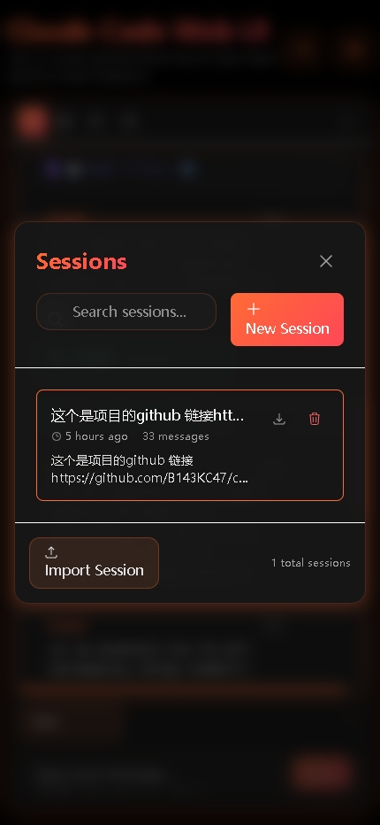
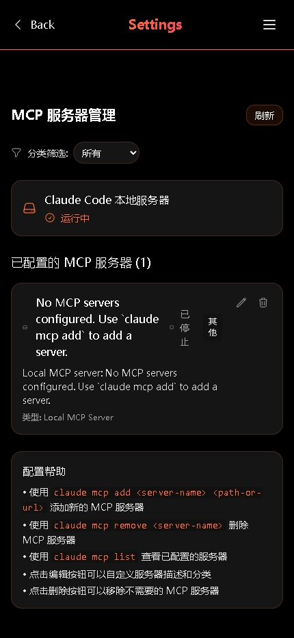

# 🚀 Claude Code WebUI

<div align="center">

[](https://github.com/B143KC47/claudeCO-webui/actions/workflows/ci.yml)
[](https://github.com/B143KC47/claudeCO-webui/actions/workflows/release.yml)
[](https://github.com/B143KC47/claudeCO-webui/releases)

</div>

<div align="center">

> **A comprehensive web interface for Claude Code with advanced session management and integrated development tools**  
> **一个功能完整的Claude Code Web界面，提供会话管理、历史记录、MCP服务器配置和集成开发工具的现代化Web应用**

</div>

---

## 🎬 Demo

<div align="center">

> **Experience the power of Claude Code WebUI in action**  
> **体验Claude Code WebUI的强大功能**

</div>

### 📸 Screenshots | 截图展示

<table align="center">
<tr>
<td align="center"><strong>Session Management</strong><br/>会话管理</td>
<td align="center"><strong>MCP Server Configuration</strong><br/>MCP服务器配置</td>
</tr>
<tr>
<td align="center"></td>
<td align="center"></td>
</tr>
<tr>
<td align="center"><strong>Chat Interface</strong><br/>聊天界面</td>
<td align="center"><strong>Project Overview</strong><br/>项目概览</td>
</tr>
<tr>
<td align="center"></td>
<td align="center"></td>
</tr>
</table>


---

## ✨ Core Features | 核心特性

### 🎯 Session Management System | 会话管理系统
- **Intelligent session organization by project**  
  **按项目智能组织会话**
- **Advanced search and filtering capabilities**  
  **高级搜索过滤功能**
- **Custom tag system for better organization**  
  **自定义标签分类系统**
- **Easy import and export functionality**  
  **轻松导入导出功能**

### 📊 History Records & Analytics | 历史记录与分析
- **Complete conversation history preservation**  
  **完整对话历史保存**
- **Visual statistics and cost analysis**  
  **可视化统计和成本分析**
- **Smart timeline view of project development**  
  **智能时间线展示项目开发历程**
- **One-click session recovery**  
  **一键恢复历史会话**

### 🔧 MCP Server Management | MCP服务器管理
- **Visual MCP server configuration interface**  
  **可视化MCP服务器配置界面**
- **Real-time server status monitoring**  
  **实时服务器状态监控**
- **Categorized server management**  
  **分类管理服务器**
- **One-click server operations**  
  **一键服务器操作**

### 🛠 Integrated Development Tools | 集成开发工具
- **Built-in terminal for command execution**  
  **内置终端执行命令行操作**
- **Visual file browser and management**  
  **可视化文件浏览和管理**
- **Integrated web browser functionality**  
  **集成的网页浏览功能**
- **Seamless tool switching interface**  
  **在多工具间无缝切换**

### 🎨 User Experience | 用户体验
- **Responsive design for all devices**  
  **响应式设计适配所有设备**
- **Dark/Light theme support**  
  **深色/浅色主题支持**
- **Real-time streaming interactions**  
  **实时流式交互体验**
- **Keyboard shortcuts for efficiency**  
  **键盘快捷键提高效率**

---

## 🚀 Quick Start | 快速开始

### Prerequisites | 前置要求

- ✅ **Claude CLI installed and authenticated**  
  **Claude CLI已安装并认证** ([Get it here | 获取地址](https://github.com/anthropics/claude-code))
- ✅ **Node.js 18+ for frontend development**  
  **Node.js 18+ 用于前端开发**
- ✅ **Deno 2.x for backend development**  
  **Deno 2.x 用于后端开发**
- ✅ **Modern browser support**  
  **现代浏览器支持** (Chrome, Firefox, Safari, Edge)

### Method 1: Binary Release (Recommended) | 方式一：使用发布版本（推荐）

```bash
# Download the latest release (macOS ARM64 example)
# 下载最新发布版本（以 macOS ARM64 为例）
curl -LO https://github.com/B143KC47/claudeCO-webui/releases/latest/download/claude-code-webui-macos-arm64
chmod +x claude-code-webui-macos-arm64
./claude-code-webui-macos-arm64

# Open browser to http://localhost:8080
# 在浏览器中打开 http://localhost:8080
```

### Method 2: Development Mode | 方式二：开发模式运行

```bash
# Clone the repository
# 克隆项目
git clone https://github.com/B143KC47/claudeCO-webui.git
cd claudeCO-webui

# Start backend service
# 启动后端服务
cd backend
deno task dev

# Start frontend (new terminal window)
# 启动前端（新终端窗口）
cd frontend
npm install
npm run dev

# Open browser to http://localhost:3000
# 在浏览器中打开 http://localhost:3000
```

---

## 🚀 Quick Start | 快速开始

### Command Line Arguments | 命令行参数

| Parameter | Description | Default |
| 参数 | 描述 | 默认值 |
|------|------|--------|
| `-p, --port <port>` | Set listening port / 设置监听端口 | 8080 |
| `--host <host>` | Set binding address / 设置绑定地址 | 127.0.0.1 |
| `-d, --debug` | Enable debug mode / 开启调试模式 | false |
| `-h, --help` | Show help message / 显示帮助信息 | - |
| `-V, --version` | Show version info / 显示版本信息 | - |

### Environment Variables | 环境变量

- `PORT` - **Same as `--port`** / **等同于 `--port`**
- `DEBUG` - **Same as `--debug`** / **等同于 `--debug`**

### Usage Examples | 使用示例

```bash
# Default configuration (localhost:8080)
# 默认配置 (localhost:8080)
./claude-code-webui

# Custom port
# 自定义端口
./claude-code-webui --port 3000

# Allow network access (use with caution)
# 允许网络访问（谨慎使用）
./claude-code-webui --host 0.0.0.0 --port 9000

# Enable debug mode
# 开启调试模式
./claude-code-webui --debug

# Using environment variables
# 使用环境变量
PORT=9000 DEBUG=true ./claude-code-webui
```

---

## 🏗 Technical Architecture | 技术架构

### Frontend Technology Stack | 前端技术栈
- **React 19** - **Modern UI framework** / **现代UI框架**
- **TypeScript** - **Type-safe JavaScript** / **类型安全的JavaScript**
- **Vite** - **Fast build tool** / **快速构建工具**
- **Tailwind CSS** - **Utility-first CSS framework** / **实用优先的CSS框架**
- **Heroicons** - **Beautiful SVG icons** / **精美的SVG图标**
- **React Router** - **Client-side routing** / **客户端路由**

### Backend Technology Stack | 后端技术栈
- **Deno** - **Modern JavaScript/TypeScript runtime** / **现代JavaScript/TypeScript运行时**
- **Hono** - **Lightweight web framework** / **轻量级Web框架**
- **Claude Code SDK** - **Official Anthropic SDK** / **Anthropic官方SDK**
- **WebSocket** - **Real-time communication** / **实时通信**
- **File System API** - **File operations** / **文件操作**

### Core Architecture | 核心功能架构
```
┌─────────────────┐    ┌──────────────────┐    ┌─────────────────┐
│   Web Frontend  │    │   Deno Backend   │    │   Claude CLI    │
│   Web前端界面   │◄──►│   Deno后端服务   │◄──►│   Claude命令行  │
│ Session Manager │    │ HTTP/WebSocket   │    │ Native Process  │
│ History Viewer  │    │ File Operations  │    │ MCP Integration │
│ MCP Config UI   │    │ Stream Handling  │    │ AI Processing   │
└─────────────────┘    └──────────────────┘    └─────────────────┘
```

---

## 🔒 Security Considerations | 安全考虑

### ⚠️ Important Notice | 重要提醒
**This tool executes Claude CLI locally and provides web access**  
**此工具在本地执行Claude CLI并提供Web访问，请注意以下安全事项**

### ✅ Safe Usage Patterns | 安全使用模式
- **🏠 Local development: Default localhost access only**  
  **🏠 本地开发：默认仅localhost访问**
- **🏢 Trusted networks: LAN access for team collaboration**  
  **🏢 可信网络：局域网内团队协作**
- **🔐 Project isolation: Claude accesses selected directories only**  
  **🔐 项目隔离：Claude仅访问选定目录**

### 🛡️ Security Recommendations | 安全建议
- **No built-in authentication: Use in trusted environments only**  
  **无内置认证：仅在可信环境使用**
- **System access: Claude can read/write project files**  
  **系统访问：Claude可读写项目文件**
- **Network exposure: Ensure network security if needed**  
  **网络暴露：如需网络访问请确保网络安全**

```bash
# Local access only (recommended)
# 仅本地访问（推荐）
./claude-code-webui --port 8080

# Network access (trusted networks only)
# 网络访问（仅可信网络）
./claude-code-webui --host 0.0.0.0 --port 8080
```

**⚠️ Never expose to public internet without proper security measures**  
**⚠️ 切勿在没有适当安全措施的情况下暴露到公网**

---

## 📚 Development Documentation | 开发文档

### Project Structure | 项目结构
```
claudeCO-webui/
├── frontend/           # React frontend application / React前端应用
│   ├── src/
│   │   ├── components/ # UI components / UI组件
│   │   ├── hooks/      # Custom hooks / 自定义Hook
│   │   ├── services/   # Service layer / 服务层
│   │   └── utils/      # Utility functions / 工具函数
├── backend/            # Deno backend service / Deno后端服务
│   ├── handlers/       # Request handlers / 请求处理器
│   ├── history/        # History processing / 历史记录处理
│   └── middleware/     # Middleware / 中间件
├── shared/             # Shared type definitions / 共享类型定义
└── docs/               # Documentation / 文档
```

### Development Guide | 开发指南
**For detailed technical documentation, see [CLAUDE.md](./CLAUDE.md), including:**  
**详细的技术文档请参考 [CLAUDE.md](./CLAUDE.md)，包含：**
- **System architecture design** / **系统架构设计**
- **API interface documentation** / **API接口文档**
- **Development environment configuration** / **开发环境配置**
- **Message type definitions** / **消息类型定义**

---

## 🤝 Contributing Guide | 贡献指南

**We welcome all forms of contributions!**  
**我们欢迎各种形式的贡献！**

### How to Contribute | 如何贡献
1. 🍴 **Fork this project** / **Fork 此项目**
2. 🌟 **Create feature branch** / **创建功能分支** (`git checkout -b feature/AmazingFeature`)
3. 💾 **Commit your changes** / **提交更改** (`git commit -m 'Add some AmazingFeature'`)
4. 📤 **Push to the branch** / **推送到分支** (`git push origin feature/AmazingFeature`)
5. 🔃 **Create Pull Request** / **创建 Pull Request**

### Development Setup | 开发设置
```bash
# Install frontend dependencies
# 安装前端依赖
cd frontend && npm install

# Run tests
# 运行测试
npm test

# Code formatting
# 代码格式化
npm run format

# Type checking
# 类型检查
npm run typecheck
```

---

## 📄 License | 许可证

**This project is licensed under the [MIT License](./LICENSE)**  
**本项目采用 [MIT License](./LICENSE) 许可证**

---

## 🙏 Acknowledgments | 致谢

### Inspiration Sources | 灵感来源
- **[sugyan/claude-code-webui](https://github.com/sugyan/claude-code-webui)** - **Provided initial inspiration and README structure reference**  
  **为本项目提供了初始灵感和README结构参考**
- **[Anthropic Claude](https://claude.ai)** - **Powerful AI programming assistant**  
  **提供强大的AI编程助手**
- **[Claude Code CLI](https://github.com/anthropics/claude-code)** - **Official command-line tool**  
  **官方命令行工具**

### Technical Acknowledgments | 技术致谢
- **React Team** - **Excellent framework for modern web development**  
  **React团队** - **为现代Web开发提供优秀框架**
- **Deno Team** - **Modern JavaScript runtime**  
  **Deno团队** - **现代的JavaScript运行时**
- **Open Source Community** - **All the open source libraries used in this project**  
  **开源社区** - **为项目使用的所有开源依赖库**

### Special Thanks | 特别感谢
**Thanks to all developers who contributed code, reported issues, and provided suggestions!**  
**感谢所有为此项目贡献代码、报告问题、提出建议的开发者们！**

---

**⭐ If this project helps you, please give it a Star!**  
**⭐ 如果这个项目对你有帮助，请给一个Star！**

**🐛 Found an issue?** [Create Issue](https://github.com/B143KC47/claudeCO-webui/issues) | **遇到问题？** [创建Issue](https://github.com/B143KC47/claudeCO-webui/issues)  
**💬 Want to discuss?** [Join Discussions](https://github.com/B143KC47/claudeCO-webui/discussions) | **想要讨论？** [参与Discussions](https://github.com/B143KC47/claudeCO-webui/discussions)